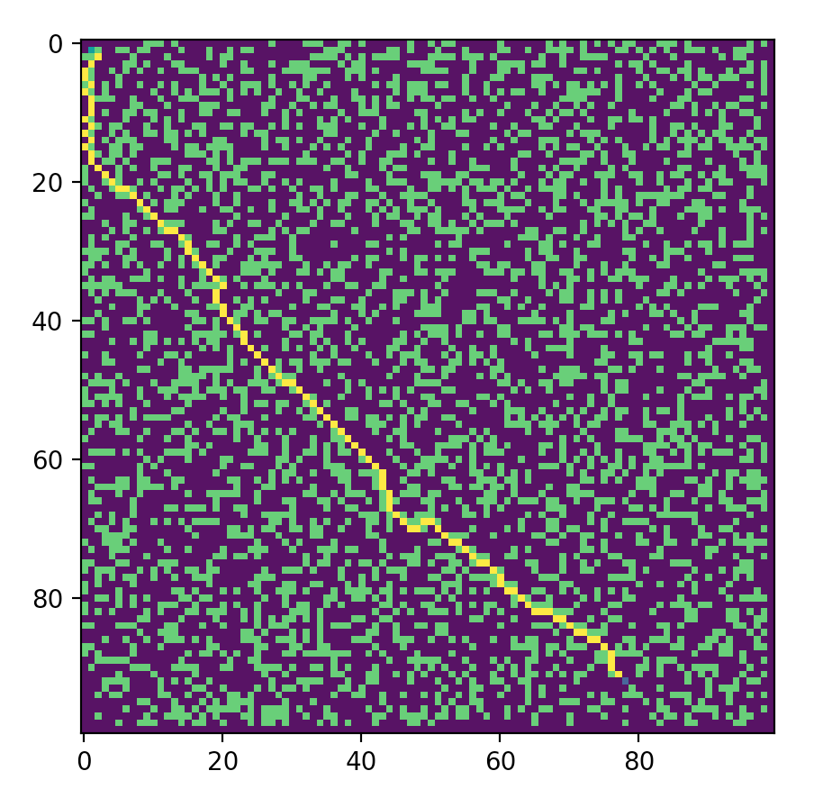

# a-star-2d-tile-pathfinding

I wanted to create and implement an A* search algorith for a friend's 2d tile based game. The main concept is that a 2d tile grid has a player, an enemy, and obstacles where players and enemies can move in 8 directions one tile at a time.

This A* pathfinder uses a Euclidian heuristic to calculate the distance of the current node's neighbors to the end node to select which neighbor is best to move to.
Given a start node, check the distance of each neighboring node to the end node. Move to the node that has the shortest distance to the end node and run the calcuation over and over until the end node is reached.

We can change the size of the grid, and the location of the enemy/player/obstacles by placing it on the grid in different locations. For a simple example, a 10x10 grid with one enemy and one player:
Green dot: enemy
Blue dot: player
yellow dots: obstacles that can not be walked on

The optimized path was calculated in 0.00072 seconds

For 100x100, optimized path was calculated in 0.0356 seconds

For an extreme case of 1000x1000, optimized path was calculated in 7.3573 seconds. In an actual use case, calculating the optimal path this far out doesn't make much sense. Instead, the enemy should walk in the direction of the player until they get within a certain range where they need to optimize path.

need to travel to a few locations, one after another, and need an optimized order?
* use Euclidian distance calculation to find closest node, move to that node, calculate closest node again. 
* Store this in a stack and use A* function to get a path to each node in order
